# Blare(ViniClock)

# What is ViniClock?

ViniClock is an alarm clock to wake me up whenever I have to go to school; I don't want to miss the bus.

## Some views of the project:

### CASE 3D
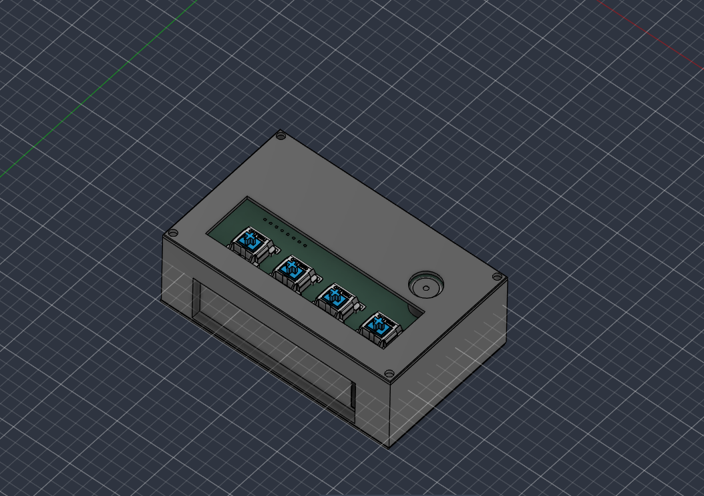
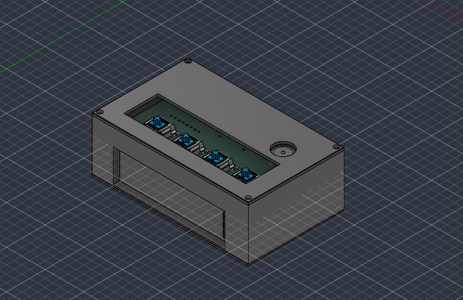

## Assembly CASE 3D:
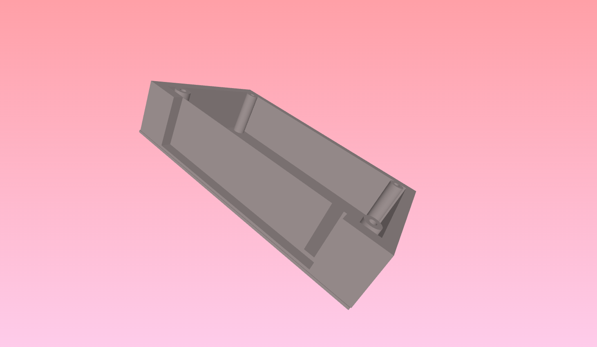
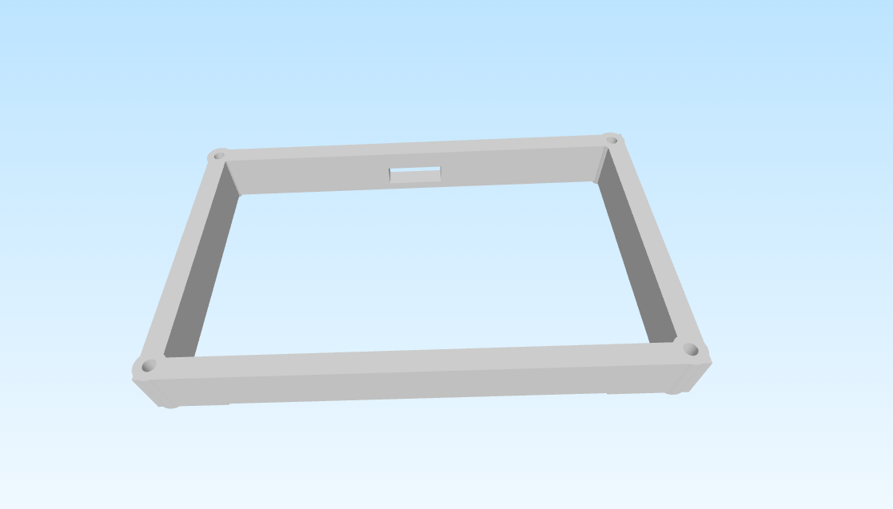
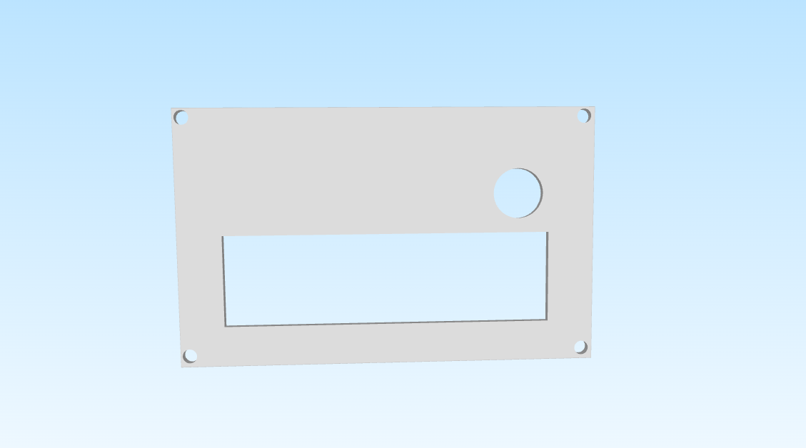

### PCB 3d
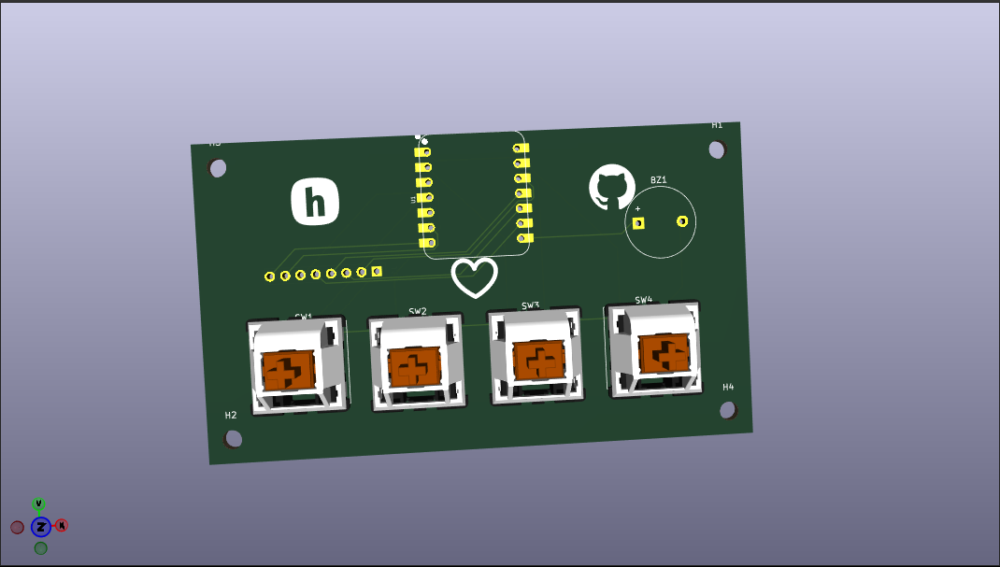
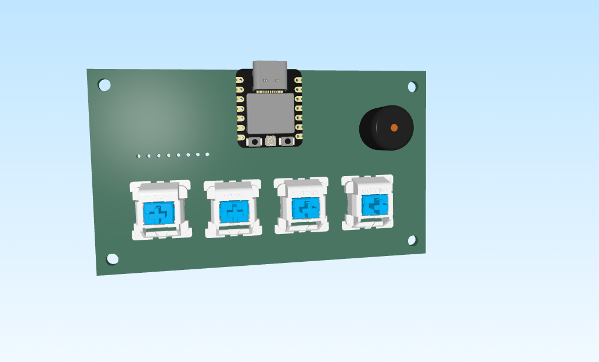

### PCB
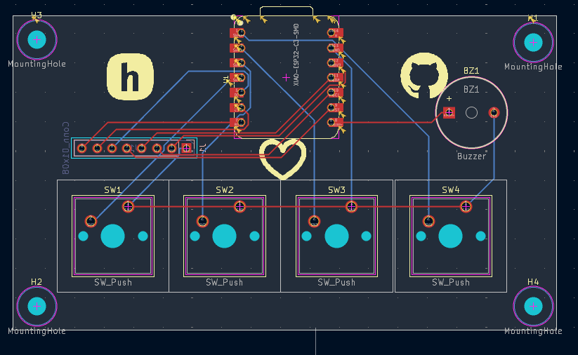
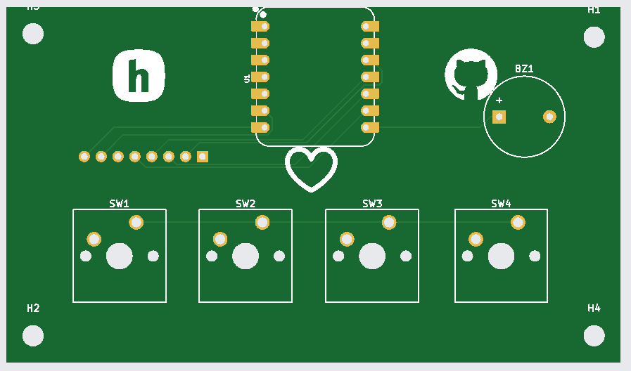
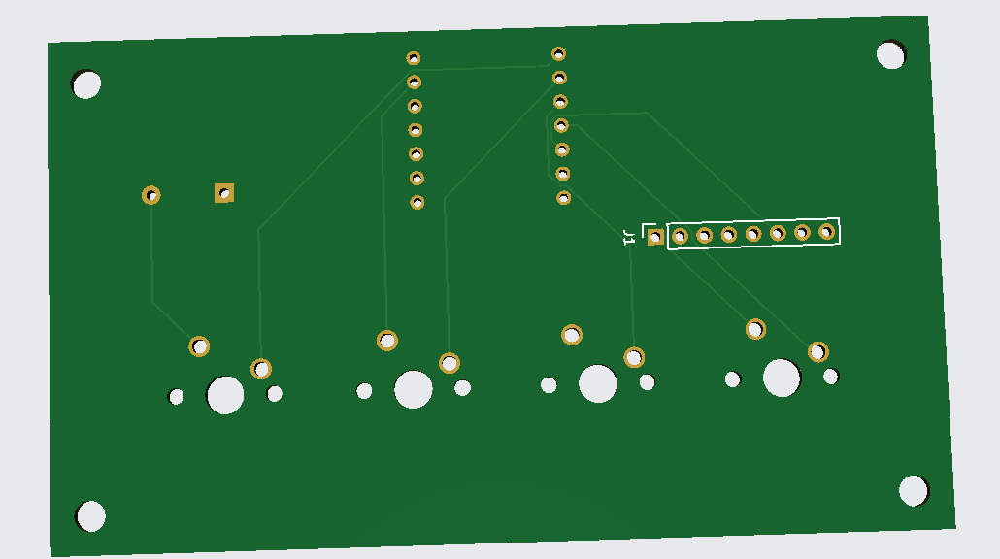

### SCHEMATIC 
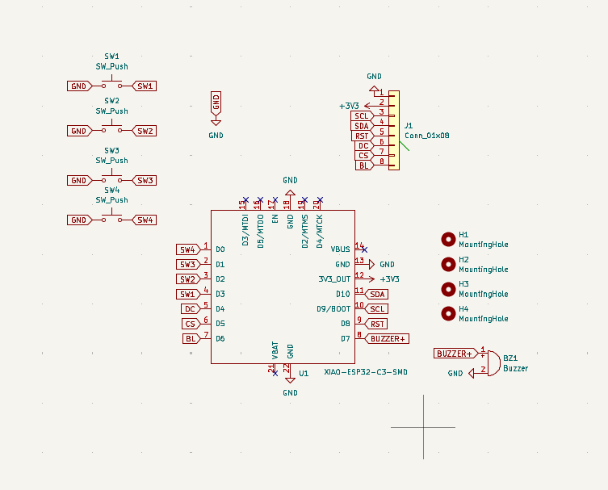

To view the diagram in more detail, download the [PDF](docs/blare.pdf) or open it right here on GitHub.

### Lessons Learned
While developing the project, I learned various concepts and 3D modeling techniques; I learned to use Fusion 360 and how to work with sketches, extrusions, and much more. I also learned—or rather, improved upon—skills in KiCad that I hadn't mastered before. Moving forward, I plan to move away from using labels and instead try wiring things up to create a really neat, organized setup.

# BOM

| Designator | Footprint | Quantity | Value | |
| :--- | :--- | :---: | :--- | :--- |
| BZ1 | Buzzer_12x9.5RM7.6 | 1 | Buzzer | |
| J1 | PinSocket_1x08_P2.54mm_Vertical | 1 | Conn_01x08 | |
| SW1, SW2, SW3, SW4 | SW_Cherry_MX_1.00u_PCB | 4 | SW_Push | |
| U1 | XIAO-ESP32-C3-DIP | 1 | XIAO-ESP32-C3-SMD | |
| TFT | 2.25in TFT Screen | 1 | | |

# Firmware
The code was written entirely in C++—I personally prefer programming in C. It wasn't too hard to write, though I'm not sure if everything is 100% correct; I'll only know for sure once I get the kit and can test it, but my ego tells me it's spot on, haha. I could have tested it on Tinkercad, but it doesn't have the specific components I need.

# Sound
There are also the notes; for now, I'm going to use the Nokia tune because I like it. I got the notes from this blog post: https://blog.eletrogate.com/relogio-despertador-arduino-com-melodia-personalizavel/ I was a bit short on ideas, so I might change it later—I think I'll create my own melody.

# How do I run it?
To run the project, you'll need to install the Arduino IDE—the tool used to upload (flash) the code to the Arduino. Once installed, connect the board to your PC using a USB-C cable (or another compatible one); the option to select the target board for flashing will appear in the top corner of the screen—just select it, and you're all set.
Don't forget to clone the repo, then copy and open my code in the Arduino IDE.

For those of you who are too lazy to do the research yourself, here’s the link served up on a silver platter.
https://support.arduino.cc/hc/en-us/articles/360019833020-Download-and-install-Arduino-IDE

Thanks! I'm going to add the timelapse of the README creation.

#### @Developer-Vini
#### Username slack: o_dev
